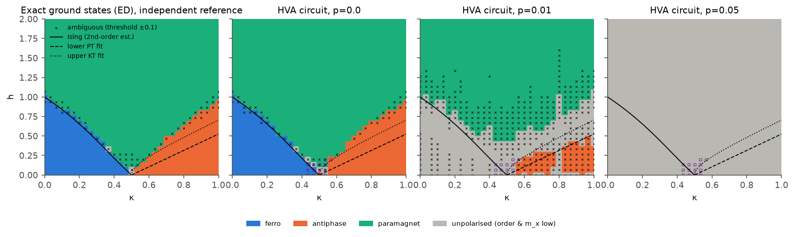

# The ANNNI phase diagram under CNOT-target depolarizing noise

**Q-SITE Hacks 2026, Scientific Open Challenge.** Benjamin, Dimitri, Yan, Frederick. Code, data and notebook: `Scientific Track/team/`; every number comes from `team/results/analysis/`. AI coding assistants were used, as permitted by the organisers.

## 1. Problem and conventions

We study $H=-\sum_i Z_iZ_{i+1}+\kappa\sum_i Z_iZ_{i+2}-h\sum_i X_i$ with Pauli operators, $J_1=1$ and **periodic** rings, for $\kappa\in[0,1]$ and $h\in[0,2]$. The phases are identified from longitudinal correlations, not from one-point magnetisations, because the latter vanish in finite symmetric ground states [S07]. We use $S(q)=\frac1N\sum_{ij}e^{iq(i-j)}\langle Z_iZ_j\rangle$ with the self-terms kept, and the floor-subtracted order parameters $O_F=(S(0)-1)/(N-1)$ and $O_A=(S(\pi/2)-1)/(N/2-1)$, which equal 1 for perfect order and 0 for an uncorrelated state. We also use the transverse magnetisation $m_x$. Validated: $S(0)=N$ (ferro), $S(\pi/2)=N/2$ (antiphase), and $S(q)=1$ for both $|+\rangle^N$ and $I/2^N$, which $m_x$ separates.

The overlays are approximate thermodynamic references, not finite-ring labels [S10, S13]: the second-order Ising estimate (rationalised so that $h_I(0)=1$), the lower antiphase–floating fit $1.05(\kappa-\tfrac12)$, which is a **Pokrovsky–Talapov** transition [S12], and the upper **KT** fit $1.05\sqrt{(\kappa-\frac12)(\kappa-0.1)}$.

## 2. Methods

**Exact reference.** Sparse `eigsh` returns the lowest six eigenpairs on 31×31 grids for N = 8, 10, 12, and on fine cuts (21 κ values × 401 h values) for all three sizes. Warm-started h sweeps agree with independent cold starts to 1e-13; degenerate ground spaces are treated as equal mixtures, and fidelity is measured between ground subspaces. The Hamiltonian matches the starter ED and `qml.matrix` to 7e-15.

**Classifier.** The thresholds come from anchor regions fixed by limiting-case physics, not from the overlay curves: ferro at κ≤0.2 and h≤0.2, antiphase at κ≥0.8 and h≤0.1, paramagnet at h≥1.8. This gives $T=0.541$ for the order parameters and $T_x=0.490$ for $m_x$. A point is ferro or antiphase if $\max(O_F,O_A)\ge T$, paramagnet if not but $m_x\ge T_x$, and otherwise *unpolarised*. Labels that flip for thresholds ±0.1 are marked ambiguous. We also report a threshold-free *relative-dominance* label, $\arg\max(O_F,O_A,m_x^2)$. Under uniform terminal depolarisation all three quantities contract by the same factor $a^{2m}$ with $a=1-4p/3$ [S28], so this label is noise-invariant in that benchmark; any change it shows therefore reveals circuit-specific noise action.

**Circuit.** We use a Hamiltonian-variational ansatz [S30]: $|+\rangle^N$ followed by $L=N/2=4$ layers of $e^{-ib\sum X}e^{-ic\sum ZZ_{nnn}}e^{-ia\sum ZZ_{nn}}$, which gives 12 parameters and preserves translation and parity symmetry. Each ZZ bond compiles to CNOT–RZ–CNOT, for **128 CNOTs** in total. (A hardware-efficient RY/CNOT ring stalled at 1–3 % energy error near the boundaries even at depth 6.) Parameters are optimised at p=0 by L-BFGS with exact adjoint gradients, forward and reverse warm-started sweeps and random restarts. Noise: `qml.DepolarizingChannel(p)` on the target after every CNOT on `default.mixed`, with the 128 channels verified on the tape; a NumPy density-matrix engine matching `default.mixed` to 3e-14 runs the ZNE and response sweeps.

**Protocol.** Fixed parameters: the same parameters, circuit, grid, thresholds and colour scales at p = 0, 0.01, 0.05. The shift $\delta h(\kappa,p)=h_b(p)-h_b(0)$ is taken for the *same circuit*; the preparation bias $h_b(0)-h_b^{\rm ED}$ is reported separately.

## 3. Clean results and finite size

At p=0 the circuit is an accurate stand-in for the exact ground states. The median relative energy error is 4e-5 and the median $1-F$ is 5e-5 (with F the ground-subspace fidelity). Only 1.5 % of points, all around the multicritical point κ≈0.5, have $F<0.9$, and the circuit labels agree with ED at 98.9 % of points. The preparation bias on the threshold boundary is at most 0.034 outside 0.42<κ<0.6, and 0.066 at κ=0.57 next to the multicritical point. Two independent optimiser seeds agree on it to a median of 0.007 (maximum 0.05).

{width=86%}

*Figure 1. The ED reference and the HVA circuit at p = 0, 0.01, 0.05 (N=8, PBC, 31×31). Purple squares mark clean preparation fidelity below 0.9; × marks threshold-ambiguous points.*

The **ferro–para** boundary is almost independent of size and tracks the Ising estimate. At κ=0.2, the fidelity-susceptibility peak moves from 0.616 (N=8) to 0.629 (N=12), towards the DMRG value 0.639 reported in [S10]; the second-order estimate is 0.653. The **antiphase** boundary drifts strongly with size. At κ=0.75 the order crossing falls from 0.562 (N=8) to 0.432 (N=12), approaching the KT fit at 0.423 from above. N=10 cannot hold a period-4 pattern and is visibly anomalous: at κ=0.6 its crossing is 0.397, against 0.244 (N=8) and 0.164 (N=12). That is a commensurability effect, not physics of the thermodynamic limit.

**Floating phase: unresolved.** At N=12 the half-chain entropy of the pure ground state peaks close to the KT fit (κ=0.75 and κ=0.9), and the boundary drifts towards the KT line as N grows. Both are *compatible* with a critical region. However, the dominant $q^*$ stays locked at $\pi/2$ between the PT and KT fits at every size. The only jumps in $q^*$ occur above the KT line, inside the modulated paramagnet [S10], and the momentum resolution ($\Delta q=\pi/6$ at N=12) cannot resolve incommensurability. We therefore claim no floating phase [S12, S23]. Label-free k-means on $(S(q)/N,m_x)$ matches the clean rule labels at 99.1 % (consistency, not independent validation).

## 4. Noise: what shifts, by how much, and why

| κ | order | $h_T^{\rm ED}$ | prep. bias | $h_D(0)$ | $\delta h_D$ (0.01) | $\delta h_D$ (0.05) | $h_T$ at p=0.01 |
|---|---|---|---|---|---|---|---|
| 0.2 | ferro | 0.685 | −0.000 | 0.653 | +0.027 | +0.64 (unreliable) | absent |
| 0.3 | ferro | 0.487 | −0.016 | 0.469 | +0.015 | +0.19 | absent |
| 0.4 | ferro | 0.246 | +0.000 | 0.248 | +0.003 | +0.006 | absent |
| 0.7 | anti | 0.467 | +0.018 | 0.477 | −0.001 | −0.004 | absent |
| 0.8 | anti | 0.650 | +0.024 | 0.672 | +0.003 | +0.045 | absent |
| 0.9 | anti | 0.809 | +0.004 | 0.723 | +0.000 | +0.098 | absent |

*Table 1. $h_T$ is the fixed-threshold crossing and $h_D$ the maximum of $-dO/dh$. The grid step is 0.067; seed spread in $\delta h_D$ at p=0.01 has median 0.011 and maximum 0.038. Full table: `boundary_shifts_circuit_N8_L4.csv`.*

**p=0.01.** The order parameters contract to a median of 0.60 of their clean values, against 0.65 if every target hit acted as terminal noise. The contraction depends on the phase. At h→0, $O_F$ at κ=0.2 drops from 1.00 to 0.37, while $O_A$ at κ=0.9 drops only to 0.59. Under the fixed threshold, **the ferromagnet disappears entirely** (0 % of ED-ferro points keep their label), 46 % of antiphase points and 89 % of paramagnet points survive. Where a threshold crossing survives, it moves **to lower h** by 0.04–0.48, the same sign as the exact first-order prediction $-p\,\partial_pO/\partial_hO$ but 1.5–4× larger, because the response is already nonlinear. The **derivative-peak boundaries barely move**: the median |δh| is 0.005 and 28 of 31 rows stay within 0.03 (half a grid step). The exceptions are κ=0.13 and 0.27 (+0.04) and κ=0.93 (−0.12). That is what S28 predicts for a near-uniform rescaling, and the relative-dominance map agrees with the clean-ED relative-dominance map at 97 % of points (99 % at p=0).

**p=0.05.** The state is essentially maximally mixed: the median purity is 0.0047, against 0.0039 for $I/2^8$. All points are unpolarised under fixed thresholds; in the relative-dominance map the *paramagnet* shrinks: $m_x$ keeps 16 % of its clean value, so $m_x^2$ keeps about 2.6 %, while the order parameters keep a median of 8.5 %.

**Mechanism: exact channel-insertion sums.** We evaluated the first-order response $\partial_p\langle O\rangle=\sum_g{\rm Tr}\{O_g\mathcal L_t(\rho_g)\}$ location by location [S28]. For the ferro state $d\ln O_F/dp=-99$, for the antiphase $d\ln O_A/dp=-69$, and for $m_x$ in the paramagnet −32 to −48. The terminal-equivalent value is −43 for pair correlators. Mid-circuit errors, carried through later CNOT–RZ–CNOT gadgets, damage ZZ order more than end-of-circuit errors. Early layers contribute most: for the ferro point, $dO_F/dp$ is −27 from layer 1 and −17 from layer 4. One consistent reading of why the ferromagnet is most fragile: its GHZ-like finite-ring ground state loses all $N(N-1)$ positive correlators in $O_F$ to a single propagated X/Y error, whereas $O_A$ mixes signs and the damage partly cancels. This ranking is specific to this circuit and diagnostic, and reverses the organiser's hypothesis [S01]. The noise does not change the Hamiltonian's spectrum, so these are maps of prepared-state diagnostics.

**Depth trade-off.** We repeated the fixed-parameter experiment for L = 1–4 on four κ cuts (`depth_tradeoff.json`, `fig_depth_tradeoff.png`). The clean error $\langle|O-O^{\rm ED}|\rangle_h$ falls with depth, while the noise error grows with it, so the best depth shrinks as p grows. The antiphase is already accurate at L=2 (clean error 0.024 at κ=0.8), and L=2 is the best depth there at both p=0.01 and p=0.05. The ferromagnet needs L=4 to be accurate (error at L=2: 0.17), and at p=0.01 its best depth is L=3. So the ferro state needs the full depth and carries the most channels.

## 5. Error mitigation

**Zero-noise extrapolation.** We ran Richardson extrapolation on every $C_{ij}$ and $\langle X_i\rangle$ at λp for λ = 1, 2, 3 (linear scaling), with the p=0 truth held out, and rebuilt S(q) before classifying. At **p=0.01** this is effective: the median $|\Delta C_{ij}|$ falls from 0.063 to 0.011, $|\Delta m_x|$ from 0.26 to 0.023, and label agreement with the clean circuit rises from 70 % to 98 %. Threshold boundaries come back to within |δh| ≤ 0.09, with a median of 0.03 (for example, κ=0.93: −0.48 → −0.04). The cost is a variance-amplification factor $\sum\gamma^2=19$. At **p=0.05** ZNE fails for both linear and composed-channel scaling: the signal is about 1 % and the extrapolation reaches p=0.15.

**Parity verification** ($P=\prod X_i$) accepts 71 % of the weight at p=0.01 and 51 % at p=0.05. It lowers the $C_{ij}$ error only from 0.063 to 0.053, because most errors stay inside the even-parity sector.

**Noise-aware re-optimisation (separate protocol, κ = 0.2, 0.3, 0.7, 0.8; 8 h values each).** Minimising $\mathrm{Tr}(H\rho_p)$ with exact gradients through the channels lowers the noisy energy by 0.2–1.0 per cut, but the order parameters move by only −0.016 to +0.028, and their error against ED is unchanged (for example, κ=0.8 at p=0.01: 0.225 → 0.198). The optimiser gains energy mainly through $m_x$ (+0.03 to +0.09) by leaving the ground state: at κ=0.2, h=0 the clean energy of the re-optimised parameters is −5.83, against −6.40 for the true ground state. Energy-optimal noisy states are therefore not diagnostic-optimal (`reopt_vs_fixed.json`).

## 6. Conclusions and limitations

The clean diagram is reproduced accurately on 8–12-site rings. For a symmetric circuit accurate enough to represent these ground states (128 CNOTs), **p=0.01 already removes the ferromagnet under fixed thresholds while boundary positions defined by derivatives stay put; p=0.05 leaves no usable signal.** ZNE recovers the p=0.01 map almost fully. Limitations: small N; overlays are approximate; the κ≈0.5 region is masked for preparation quality; the maps use the fixed-parameter protocol (re-optimisation only on cuts); simulations are exact, with no shot noise.

\footnotesize
**References** (full entries in `team/literature/`): [S01] organiser handout; [S07] starter-kit audit; [S10] Beccaria, Campostrini, Feo, PRB 73, 052402 (2006); [S12] Cea et al., arXiv:2402.11022 (2024); [S13] Beccaria, Campostrini, Feo, PRB 76, 094410 (2007); [S19] Temme, Bravyi, Gambetta, PRL 119, 180509 (2017); [S21] Bonet-Monroig et al., PRA 98, 062339 (2018); [S23] Sandvik, AIP Conf. Proc. 1297, 135 (2010); [S28] our channel-response derivation; [S30] Wecker, Hastings, Troyer, arXiv:1507.08969 (2015). Tools: PennyLane 0.44.1, NumPy, SciPy, Matplotlib.
